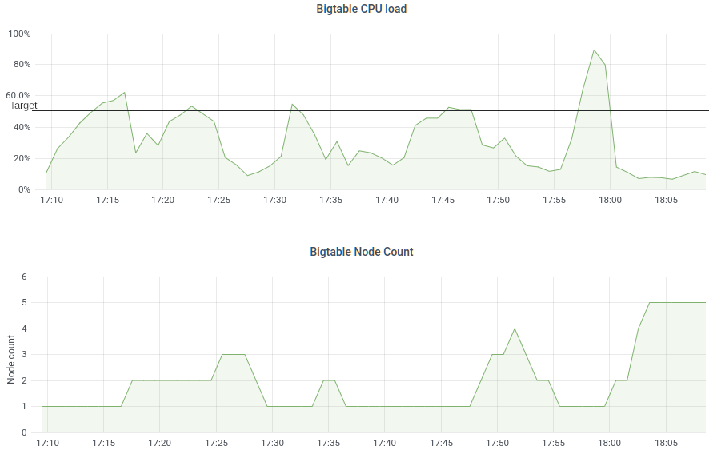

[](https://circleci.com/gh/ResultadosDigitais/bigtable-autoscaler-operator)
[](https://github.com/ResultadosDigitais/bigtable-autoscaler-operator/releases/latest)

# Bigtable Autoscaler Operator 
**Bigtable Autoscaler Operator** is a [Kubernetes Operator](https://coreos.com/operators/) to autoscale the number of nodes of a [Google Cloud Bigtable](https://cloud.google.com/bigtable) instance based on the CPU utilization.

## Overview
[Google Cloud Bigtable](https://cloud.google.com/bigtable) is designed to scale horizontally, meaning that the number of nodes of an instance can be increased to balance and reduce the average CPU utilization.
For Bigtable applications dealing with high variances of workload, the procedure of managing the amount of nodes must be fully automated for a better resource cost.
This operator automates Bigtable scaling by reconciling the number of nodes and the CPU utilization with the `minNodes`, `maxNodes`, and `targetCPUUtilization` manifest specifications.

The reconciler behavior is to keep the CPU utilization of the instance bellow the target specification, it does that while respecting the minimum and maximum amount of nodes.
When the CPU utilization is above the target, the reconciler will increase the amount of nodes in steps linearly proportional to how above it is from the target.
For example, considering 100% of CPU utilization and only one node running, if the CPU target is 50%, it increases to 2 nodes, but if the CPU target is 25% it increases to 4 nodes.

The downscale also follows a linear rule, but it considers the `maxScaleDownNodes` specification which defines the maximum downscale step size in order to avoid aggressive downscale.
Furthermore, the downscale step is calculated using the amount of current nodes running and the CPU target. For example, if there are two nodes running and the CPU target is 50%, in order to downscale
occur the CPU utilization must go bellow 25%. This is important to avoid downscale that immediately causes upscale.

All scale operations are made respecting a reaction time window, which at time is not part of the manifest specification.

The image bellow shows how peaks above the CPU target of 50% are shortened by the automatic increase of nodes.


## Prerequisites
1. Enable APIs [Bigtable](https://cloud.google.com/bigtable/docs/access-control) and [Monitoring](https://cloud.google.com/monitoring/api/enable-api) on your GCP project.
1. Generate a service account secret with the role for Bigtable administrator.

## How to install in a Kubernetes cluster
These are the steps for applying the released builds into a Kubernetes cluster.

TODO

## Development environment
These are the steps for setting up the development environment. 

This project is using go version 1.13 and other tools with its respective version, we don't guarantee that using other versions can perform successful builds.

1. Install [kubebuilder](https://book.kubebuilder.io/quick-start.html#installation) version 2.3.2. 
    1. Also make sure that you have its dependencies installed: [controller-gen](https://github.com/kubernetes-sigs/controller-tools/) version 0.5.0 and [kustomize](https://kubectl.docs.kubernetes.io/installation/kustomize/) version 3.10.0 

1. Follow [Option 1](#option-1) or [Option 2](#option-2) section.

### Option 1: Run with Tilt (recomended)
Tilt is tool to automate development cycle and has features like hot deploy.

1. Install tilt version 0.19.0 (follow the [official instructions](https://docs.tilt.dev/install.html)). 
   1. Install its dependencies: ctlptl and kind (or other tool to create local k8s clusters) as instructed.
1. If it doesn't exist, create your k8s cluster using ctlptl

    ``` sh
    ctlptl create cluster kind --registry=ctlptl-registry
    ```
1. Provide the secret with the service account credentials and role as described in section [Secret setup](#secret-setup).
1. Run `tilt up`

### Option 2: Manual run
Running manually requires some extra steps!

1. If it doesn't exist, create your local k8s cluster. Here we will use kind to create it:
    ```sh
    kind create cluster
    ```

1. Provide the secret with the service account credentials and role before as described in section [Secret setup](#secret-setup).

1. check that your cluster is correctly running
    ```sh
    kubectl cluster-info
    ```

1. Apply Custom Resource Definition
    ```sh
    make install
    ```

1. Build docker image with manger binary
    ``` sh
    make docker-build
    ```

1. Load this image to the cluster
    ```sh
    kind load docker-image controller:latest
    ```

1. Deploy the operator to the local cluster
    ```sh
    make deploy
    ```

1. Apply the autoscaler sample
    ```sh
    kubectl apply -f config/samples/bigtable_v1_bigtableautoscaler.yaml
    ```

1. Check pods and logs
    ```sh
    kubectl -n bigtable-autoscaler-system logs $(kubectl -n bigtable-autoscaler-system get pods | tail -n1 | cut -d ' ' -f1) --all-containers
    ```


## Secret setup
1. Use the service account from the [Prerequisites](#prerequisites) section to create the k8s secret
    ```sh
    kubectl create secret generic bigtable-autoscaler-service-account --from-file=service-account=./your_service_account.json
    ```

1. Create role and rolebinding to read secret
    ```sh
    kubectl apply -f config/rbac/secret-role.yml
    ```

## Running tests
    ```sh
    go test ./... -v
    ```
 or
 
    ```sh
    gotestsum
    ```
